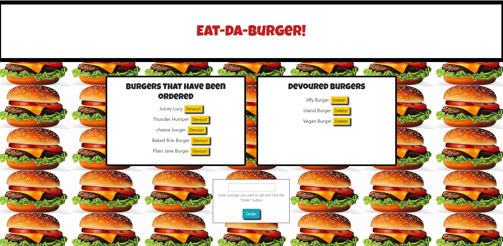

# Burger



>Eat-Da-Burger!

---

### Table of Contents

* [Description](#description)
* [How To Use](#how-to-use)
* [References](#references)
* [License](#license)
* [Author Info](#author-info)

---

## Description
This application allows for the user to enter the name of a burger they would like to order. That burger is than placed on the left hand side of the screen with a bu tton named "devour." When the user click on the devour button it is then moved to the right handside under "Devoured Burgers."

#### Technologies

- Express
- Express-handlebars
- MYSQL

---

## How To Use

#### Installation
To install this application you will need to first download or copy the repo from GitHub. After which, go to your command line and type in "npm i" to install all neccessary dependencies. Once installed type in "node server.js" this will connect you to the server. 
```NPM
    npm i
    node server.js
```

#### API Reference
    none

[Back To The Top](#burger)

---

## References

- Heroku - [Heroku](url)

[Back To The Top](#burger)

---

## License

none

[Back To The Top](#burger)

---

## Author Info

- GitHub - [F1sherE20](https://github.com/FisherE20/Burger)
- Website - [F1sherE20](https://fishere20.github.io/Responsive-Portfolio/) 

[Back To The Top](#burger)